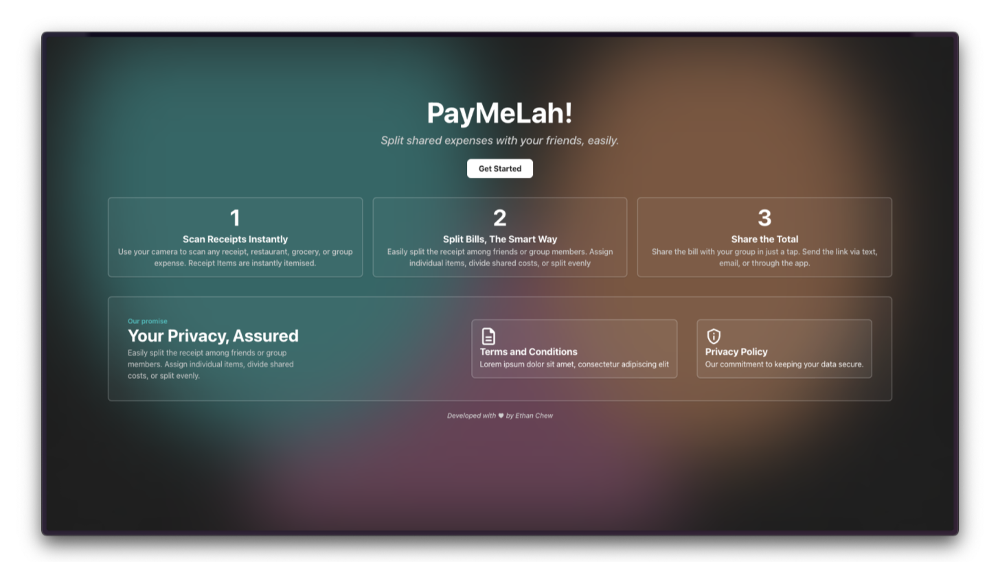

# PayMeLah! 💸

> **_Split shared expenses with your friends, easily._**

PayMeLah! simplifies the process of splitting bills and shared expenses among friends, through the use of AI-powered receipt scanning and smart expense distribution.

## Motivation

Whenever I go out with friends, I always end up being the one paying. Instead of just sending a photo of the receipt (which is pretty error-prone, like forgetting the GST or accidentally paying for it when it's already included), _is there a better way to handle this?_

Current Optical Character Recognition (OCR) methods are not sufficient, as different restaurants or shops may use different receipt formats, making it practically impossible to handle every case. So, why not leverage the rise of affordable Large Language Models (LLMs) to handle the job (~S$0.003181 per receipt)?

## Using PayMeLah!

1. Simply **Scan** or **Upload** an image from your Phone/Laptop
2. Allow the LLM to work its ✨magic✨
3. Enter some details about your Receipt, like who was with you
4. Review Receipt Items detected by the LLM, update them as required
5. Complete and Share with your friends!

## Some... Considerations

> [!WARNING]  
> Due to the inherent nature of Large Language Models, the LLM may occasionally produce inaccurate results or "hallucinations."

While I've optimized the prompt to minimize token usage while maximizing accuracy, errors can still occur. Users will still have to review and edit the AI-generated receipt parsing results as needed to ensure complete accuracy.

- The current model used by PayMeLah! is `gpt-4o-mini`, which is the cheapest vision-enabled model from OpenAI (as of December 2024).

PayMeLah!'s design was inspired by Glassmorphism, using design elements with the appearance of Frosted Glass.

## Technology Stack

### Frontend

- **Next.js 15** - React framework with App Router
- **TypeScript** - Type-safe JavaScript development
- **Tailwind CSS 4** - Modern CSS framework
- **Framer Motion** - Smooth animations and transitions
- **React Icons** - Icon library

### Backend & Database

- **PostgreSQL** - Robust relational database
- **Drizzle ORM** - Type-safe database toolkit
- **Supabase** - Backend-as-a-Service platform

### AI & Processing

- **OpenAI API** - Intelligent receipt parsing and OCR
- **Langfuse** - LLM observability and monitoring

## Future Improvements

PayMeLah! is in its prototype stage, and I'll try my best to update it as time passes.

- **Receipt Processing**: Improve AI accuracy for different receipt types
- **Account-Based System**: Allow users to save groups of friends they often hang out with
